# 키메라 비주얼 보강 구현 상세 보고서

> 기준 브랜치: `feat/Chimera-Polishing`  
> 기준 커밋: `05cad68a feat(chimera): add per-segment decal trails`  
> 작성 기준일: 2026-09-08  
> 대상 엔진: Unreal Engine 5.7

## 1. 문서 목적과 범위

이 문서는 `BP_CMChimera` 비주얼 보강 작업에서 현재까지 실제로 추가하거나
변경한 코드와 콘텐츠를 설명한다. 원래 요구사항 전체를 다시 기술하는 계약서가
아니라, 현재 저장소에서 동작하는 구현을 다음 기준으로 추적하는 문서다.

- 새로 추가된 파일과 각 파일의 책임
- 기존 파일에서 변경된 지점과 변경 이유
- 몸통 컴포지션, 표면 샘플링, Idle 촉수, 파츠 연결 촉수, 이동 궤적의 실행 원리
- 서버 권한과 로컬 cosmetic 표현의 경계
- Blueprint 에디터 크래시 핫픽스의 원인과 방지 구조
- 자동화 테스트가 보장하는 범위
- 아직 구현되지 않은 후속 페이즈

모델링·임포트 규격과 향후 구현 계약은
[`Chimera_Visual_Reinforcement_Implementation_Contract.md`](./Chimera_Visual_Reinforcement_Implementation_Contract.md)를
함께 참고한다.

## 2. 현재 구현 요약

현재 구현은 기존 `BodyMesh_n` 물리 마디를 유지하면서 그 아래에 독립된 시각 표현
Actor를 1:1로 연결한다. 머리·몸통·꼬리는 별도 게임플레이 타입이 아니라 활성 마디
인덱스로 결정되는 시각 역할이다.

각 시각 마디는 다음을 가진다.

- 역할별 Skeletal Mesh를 표시하는 `BodyVisual`
- 기존 파츠 탐지·예약·당기기 기능을 담당하는 고정 `TentacleActor`
- 촉수마디 Static Mesh 표면에서 생성되는 로컬 Idle spline 촉수
- 지정한 Static/Skeletal Mesh 표면을 따라 자라는 로컬 휘감기 spline 촉수
- 키메라의 각 활성 물리 마디가 지면에 남기는 로컬 decal 궤적

현재까지 완료된 범위는 다음과 같다.

| 영역 | 상태 | 핵심 결과 |
| --- | --- | --- |
| 몸통 컴포지션 | 구현 완료 | 최대 16개 물리 마디와 16개 presentation을 1:1로 고정 구성 |
| Head/Body/Tail 역할 | 구현 완료 | 인덱스 기반 역할 결정과 역할별 시각 프리셋 적용 |
| 메시 정의·검증 | 코드 완료 | 공용 Skeleton, 본, Sampling Region, Physics Asset 자동 검증 |
| 기존 TentacleActor 내장 | 구현 완료 | 마디 Blueprint가 제작 시점부터 ChildActor 슬롯을 소유 |
| 파츠 방향 촉수 | 구현 완료 | 파츠 Actor 원점이 아니라 실제 Skeletal Mesh 표면을 목표로 사용 |
| Idle 표면 촉수 | 구현 완료 | Skeletal/Static Mesh 표면 샘플링과 spline mesh 애니메이션 |
| 키메라 이동 궤적 | 구현 완료 | 모든 활성 마디의 거리 기반 decal stamp, 60초 수명과 수동 alpha fade |
| Blueprint 열기 크래시 | 수정 완료 | 에디터 preview의 재귀 ChildActor 생성을 차단 |
| 타겟 메시 표면 휘감기 | 수직 슬라이스 완료 | 거리순 Static/Skeletal 표면 anchor, 다중 spline, pose 추종, 근접 전개·회수 |
| 하부 무수한 팔 Niagara | 미구현 | `UnderbodyArms` Sampling Region 계약만 정의됨 |
| Death 외피 래그돌 | 미구현 | 필수 본·Physics Asset 검증 계약만 구현됨 |
| IK/Control Rig | 미구현 | Planted/Dragged/Secondary 분류와 적용 순서만 확정됨 |

## 3. 전체 런타임 구조

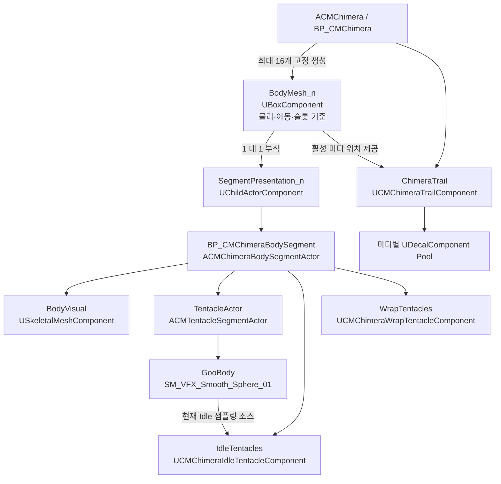

### 3.1 물리와 시각의 분리

`BodyMesh_n`이라는 기존 이름은 유지되지만 실제 타입은 `UBoxComponent`다. 이
컴포넌트는 다음 게임플레이 책임을 계속 가진다.

- 마디 물리와 constraint
- 마디 위치 및 네트워크 물리 상태
- 좌·우 파츠 슬롯의 부모
- hurtbox와 마디 체력 주소의 기준
- 이동 궤적의 월드 위치 소스

새 Head/Body/Tail Skeletal Mesh는 물리 컴포넌트를 교체하지 않는다. 대신
`SegmentPresentation_n` 아래 `BodyVisual`에 할당된다. 이 분리 덕분에 시각 메시,
AnimBP 또는 VFX가 교체돼도 기존 슬롯 주소와 물리 시뮬레이션을 유지할 수 있다.

## 4. 구현 커밋 순서

| 커밋 | 역할 |
| --- | --- |
| `18006245` | 비주얼 보강 구현 계약과 단계별 진입 조건 정의 |
| `f7e13bf9` | 고정 몸통 presentation, Visual Definition, Idle 촉수, 내장 TentacleActor 구현 |
| `1f3cf8b9` | `BP_CMChimeraBodySegment` 및 촉수마디 Static Mesh 콘텐츠 연결 |
| `219beae1` | 역할, 메시 계약, Idle 수학, Blueprint 통합, 파츠 촉수 렌더링 테스트 확장 |
| `60cc75d9` | `BP_CMChimera` Details 재귀 생성·stack overflow 핫픽스 |
| `05cad68a` | 활성 마디별 이동 궤적, 전용 decal 머티리얼, 수명·fade 테스트 구현 |

## 5. 몸통 컴포지션 리팩토링

### 5.1 고정 presentation 생성

`ACMChimera` 생성자는 기존 최대 마디 수만큼 `SegmentPresentation_n`을 만들고 각
`BodyMesh_n`에 부착한다. 플레이어 수가 변해도 presentation Actor를 반복해서
생성하거나 파괴하지 않는다.

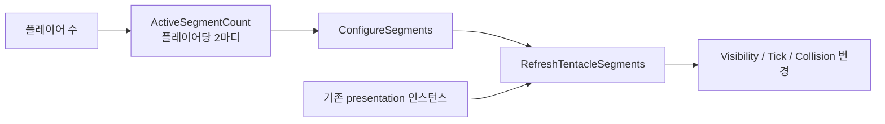

활성 수가 줄면 다음만 비활성화한다.

- `BodyVisual` visibility와 animation tick
- `TentacleActor` detection collision과 tick
- `IdleTentacles` tick과 spline mesh visibility

다시 활성화하면 같은 인스턴스와 같은 `SegmentIndex`를 재사용한다. 파츠 슬롯 주소는
`SegmentIndex * 2 + PartSlotIndex`이므로 시각 역할 변경과 무관하게 안정적이다.

### 5.2 Head/Body/Tail 역할 결정

역할은 `CMChimeraVisual::ResolveSegmentVisualRole()` 순수 함수가 결정한다.

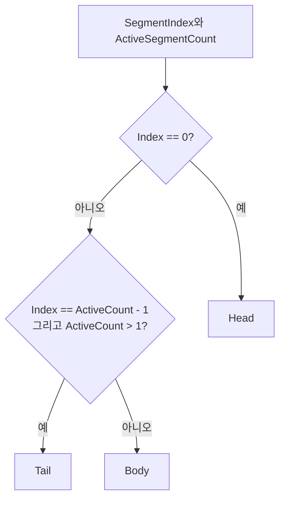

| 플레이어 | 활성 마디 | 역할 배열 |
| ---: | ---: | --- |
| 1 | 2 | Head, Tail |
| 2 | 4 | Head, Body, Body, Tail |
| 3 | 6 | Head, Body × 4, Tail |
| 8 | 16 | Head, Body × 14, Tail |

### 5.3 `ACMChimeraBodySegmentActor`

한 presentation Actor는 다음 컴포넌트를 생성자에서 고정 소유한다.

| 컴포넌트 | 타입 | 책임 |
| --- | --- | --- |
| `SceneRoot` | `USceneComponent` | presentation 로컬 기준 |
| `BodyVisual` | `USkeletalMeshComponent` | 역할별 Head/Body/Tail 메시와 Anim Class 표시 |
| `TentacleActor` | `UCMRuntimeChildActorComponent` | 기존 파츠 연결 촉수의 안정적인 슬롯 |
| `IdleTentacles` | `UCMChimeraIdleTentacleComponent` | 로컬 표면 샘플링과 spline mesh 풀 |

`SetSegmentPresentation()`은 활성 상태와 시각 역할을 한 번에 적용한다. 역할이
바뀌면 `ApplyVisualPreset()`과 Blueprint 이벤트
`K2_ApplySegmentVisualRole()`을 호출하고, 활성 상태가 바뀌면
`K2_SetSegmentVisualActive()`를 호출한다.

### 5.4 내장 TentacleActor의 수명주기

기존에는 `RefreshTentacleSegments()`가 활성 마디 수에 맞춰 TentacleActor를 직접
Spawn/Destroy했다. 현재는 마디 presentation이 이미 가진 ChildActor를 찾아
`InitializeForSegment()`와 `SetSegmentActive()`만 호출한다.

이 구조의 효과는 다음과 같다.

- 플레이어 수 변경 시 Actor 수명주기 흔들림 제거
- `SegmentIndex`와 물리 마디 연결 유지
- Blueprint에서 마디 단위 촉수 구성을 명시적으로 확인 가능
- 비활성 마디의 비용을 collision/tick/visibility 차단으로 제어

## 6. Visual Definition과 모델 임포트 검증

### 6.1 역할별 프리셋

`UCMChimeraVisualDefinition`은 Head, Body, Tail마다 다음 값을 가진다.

- `USkeletalMesh* Mesh`
- 선택적 `TSubclassOf<UAnimInstance> AnimClass`
- 위치·회전 보정용 `RelativeTransform`

역할이 바뀌어도 `BodyVisual` 컴포넌트를 교체하지 않고 프리셋 값만 다시 적용한다.
Scale은 반드시 `(1, 1, 1)`이어야 한다.

### 6.2 Data Validation

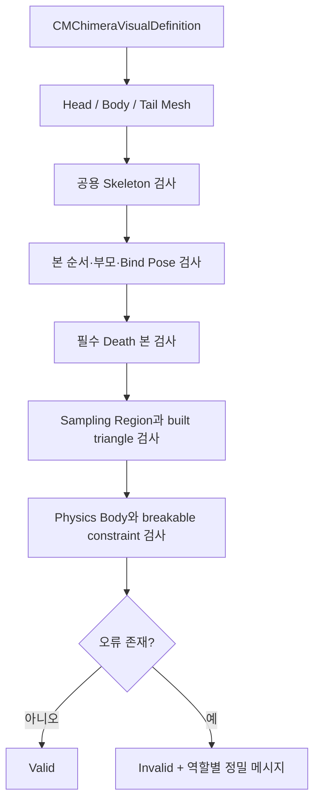

필수 본은 다음과 같다.

```text
root
├─ core_root
├─ shell_a_root
├─ shell_b_root
└─ shell_c_root
```

필수 Sampling Region은 다음과 같다.

| Region | 예정 용도 |
| --- | --- |
| `IdleTentacleTop` | Skeletal Mesh 외피 상단의 Idle 촉수 anchor |
| `UnderbodyArms` | 후속 Niagara 하부 팔 방출 위치 |

검증기는 Sampling Region의 존재뿐 아니라 유효한 LOD와 built triangle 존재 여부도
확인한다. Physics Asset에서는 core와 외피 세 본의 body, 그리고 외피별 linear 또는
angular breakable constraint를 확인한다.

최종 Head/Body/Tail 원본 메시가 아직 확정되지 않았기 때문에 비어 있는
Visual Definition Data Asset은 의도적으로 생성하지 않았다. 불완전한 Data Asset이
프로젝트 전체 validation을 항상 실패시키는 것을 방지하기 위한 결정이다.

## 7. Blueprint 에디터 크래시 핫픽스

### 7.1 원인

`BP_CMChimera`를 Blueprint Editor에서 열 때 preview Actor가 만들어지고,
construction 중 `ChildActorClass`를 다시 설정하면서 construction hierarchy가
재구성됐다. 이 과정이 다시 preview ChildActor 생성을 호출해 Details 패널에서
재귀적으로 진입했고 stack overflow 또는 검은 편집기 화면으로 이어졌다.

### 7.2 수정 원리

`UCMRuntimeChildActorComponent::CreateChildActor()`는 Editor 환경에서 현재 World가
Game World가 아니면 ChildActor를 생성하지 않고 기존 preview Actor를 제거한다.

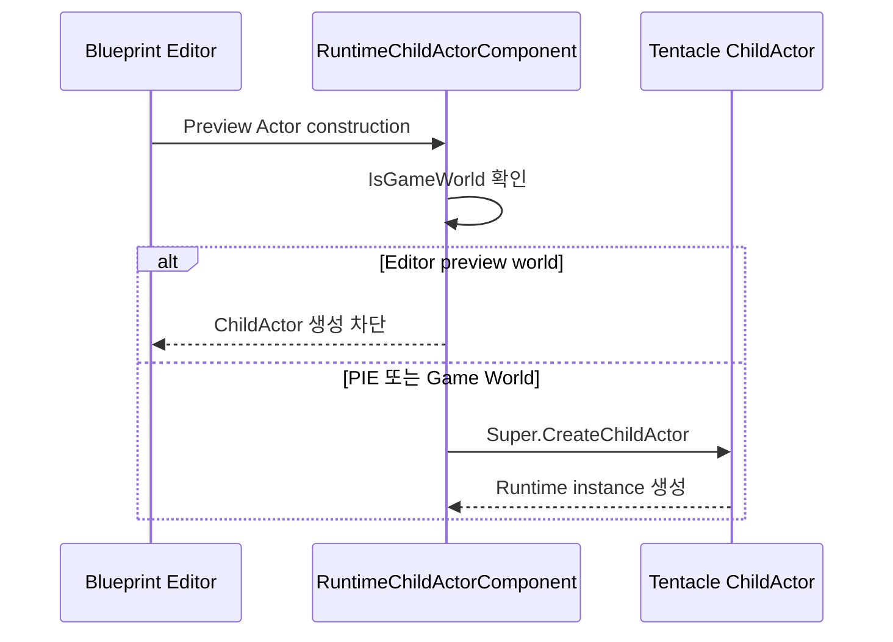

추가로 `ApplyBlueprintSettings()`의 construction 경로에서는
`ChildActorClass`를 변경하지 않는다. 런타임의 `BeginPlay()` 및
`RefreshTentacleSegments()`에서만 presentation class를 동기화한다.

`BodySegmentPresentationClass` 기본값은 C++ native fallback을 가진 뒤
`BP_CMChimeraBodySegment` class를 constructor hard reference로 로드한다. 따라서
legacy `BP_CMChimera`에 직렬화된 잘못된 class override와 독립적으로 정상 기본값을
얻는다.

## 8. 파츠 방향 연결 촉수

`ACMTentacleSegmentActor`는 기존 서버 권한 파츠 부착 기능을 유지하면서 클라이언트
시각 spline mesh를 직접 관리하도록 확장됐다.

### 8.1 권한과 상태

- 서버가 overlap 후보 선택, 예약, pull 시작과 완료를 결정한다.
- `TetheredActor`, `TentacleState`, `VisualSeed`, `SegmentIndex`를 복제한다.
- 클라이언트는 복제된 타겟과 seed를 사용해 spline mesh만 렌더링한다.
- Dedicated Server에서는 시각 컴포넌트를 만들지 않는다.

### 8.2 분리형 래그돌 파츠의 실제 메시 표면 추적

파츠 Actor 원점은 분리된 Skeletal Mesh의 현재 래그돌 위치와 다를 수 있다.
따라서 목표 위치는 다음 순서로 계산한다.

1. `ACMDroppedPartActor` 또는 `ACMPartActorBase`에서 실제 `PartMesh`를 얻는다.
2. `K2_GetClosestPointOnPhysicsAsset()`으로 촉수마디에 가장 가까운 Physics Asset
   표면점을 계산한다.
3. 계산에 실패하면 Skeletal Mesh `Bounds.Origin`을 사용한다.
4. Mesh를 얻을 수 없는 일반 Actor만 Actor 원점을 fallback으로 사용한다.

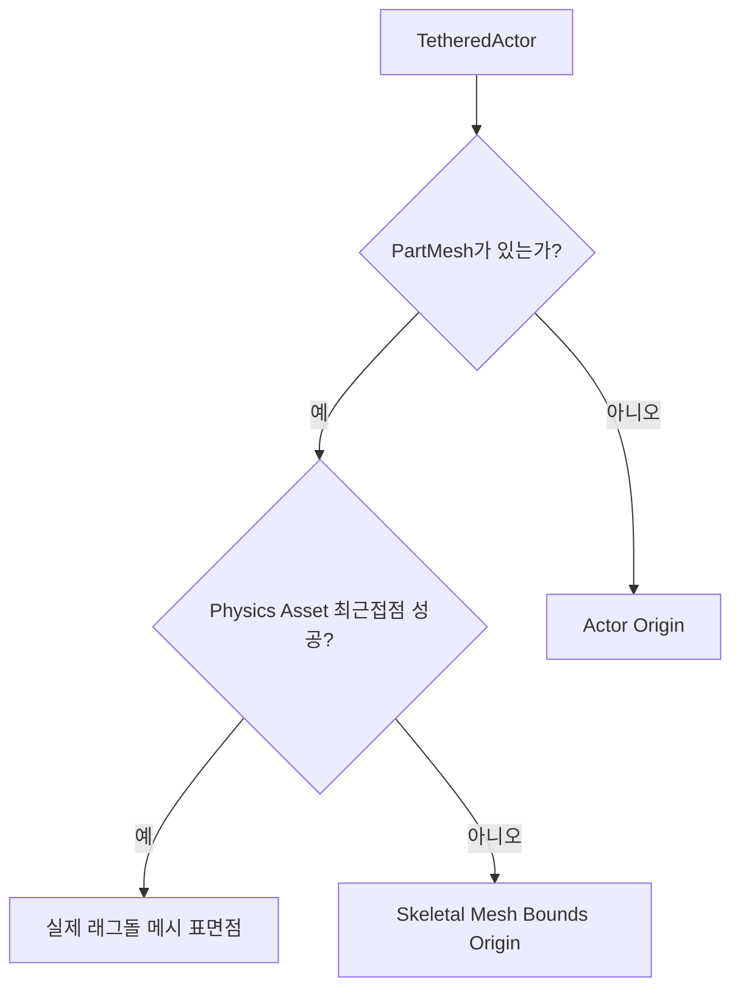

### 8.3 spline mesh 표현

- 기존 `SM_VFX_Arm_03` 계열 메시와 `MI_VFX_Goo_Arm_01` 계열 재료를 사용한다.
- local `+X`를 spline forward axis로 사용한다.
- `VisualAlpha`가 extension/retraction 시간에 따라 0과 1 사이에서 이동한다.
- 목표점까지의 중간 tangent에 seed 기반 노이즈를 더한다.
- `WPO Collapse Lerp`를 갱신해 메시 수축을 함께 표현한다.
- 파츠 방향 촉수 굵기는 `TetheredTentacleWidth=1.8`이다.
- 타겟 Niagara는 Actor Root가 아니라 가능하면 실제 PartMesh에 부착한다.

이 구현은 현재 **한 개 spline span으로 파츠 표면에 연결되는 촉수**다. 타겟 메시
표면을 여러 점으로 따라가며 덩굴처럼 감는 기능과는 다르다.

## 9. 표면 샘플러와 Idle 촉수

### 9.1 현재 샘플링 소스

`ACMChimeraBodySegmentActor::RefreshIdleTentacleSource()`는 다음 우선순위를 사용한다.

1. 마디의 `TentacleActor`가 존재하면 `GooBody` Static Mesh
2. 그렇지 않으면 역할별 `BodyVisual` Skeletal Mesh

현재 콘텐츠에서는 `GooBody`에
`SM_VFX_Smooth_Sphere_01`이 연결되어 있으므로 Idle 촉수는 캐릭터 본체가 아니라
각 촉수마디 구체 표면에서 생성된다.

### 9.2 Skeletal Mesh 샘플링

Skeletal Mesh 경로는 `IdleTentacleTop` Sampling Region을 사용한다.

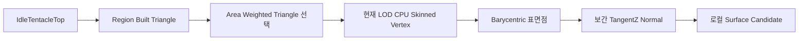

주요 원리는 다음과 같다.

- 활성화 또는 소스 메시 변경 시점에만 CPU skinned vertex를 읽는다.
- triangle 내부 점은 균일한 barycentric 샘플을 사용한다.
- built data의 area weighted sampler가 있으면 면적 비례로 triangle을 고른다.
- vertex `TangentZ`를 barycentric weight로 보간해 표면 normal을 만든다.
- 보간 normal이 유효하지 않으면 triangle edge의 cross product를 사용한다.
- 후보 위치와 normal을 Idle 컴포넌트 로컬 공간으로 변환해 저장한다.
- 매 프레임 전체 skinned vertex를 다시 읽지 않는다.

이 경로를 사용하려면 해당 LOD의 CPU 접근과 Sampling Region built data가 필요하다.

### 9.3 Static Mesh 샘플링

Static Mesh 경로는 별도 Sampling Region이 없으므로 render LOD의 triangle을 직접
필터링한다.

- 기본 LOD: `StaticMeshLODIndex=0`
- 메시 bounds 높이의 상위 50% 이상만 허용
- local normal과 `+Z`의 dot이 `0.1` 이상인 triangle만 허용
- degenerative triangle 제외
- 남은 triangle을 면적 비례로 선택
- 선택된 triangle 내부에서 barycentric 점과 보간 normal 생성

`SM_VFX_Smooth_Sphere_01`에는 이 런타임 접근을 위해 CPU Access가 설정되어 있다.

### 9.4 최소 간격

한 마디에서 이미 활성화된 anchor를 모은 뒤 새 후보와의 제곱거리를 비교한다.
`MinimumSampleDistance` 안에 있는 후보는 거부하며, 전체 후보를 순회해도 적합한 점이
없으면 0.1초 뒤 다시 시도한다.

### 9.5 spline과 mesh pool

마디마다 `TentacleCount` 크기의 런타임 풀을 한 번 구성한다. 한 촉수는 다음으로
구성된다.

- `SplinePointCount`개의 spline point
- `SplinePointCount - 1`개의 `USplineMeshComponent`
- 시작은 굵고 끝은 30%로 가늘어지는 scale
- `SM_VFX_Arm_03`과 `MI_VFX_Goo_Arm_01`

컴포넌트는 매 생명주기에 생성·파괴되지 않는다. 비활성 시 숨긴 뒤 다음 anchor에서
재사용한다. `UpdateMesh()`, `UpdateBounds()`, `MarkRenderTransformDirty()`를 매 갱신에
호출해 게임 플레이 중 spline mesh가 첫 프레임 이후에도 계속 렌더링되도록 했다.

### 9.6 곡선과 생명주기

각 spline point는 다음 개념식으로 계산한다.

```text
Point = Anchor
      + Normal * Length * DistanceAlpha * LengthAlpha
      + WaveOffset

WaveOffset = (AxisX * sin(Phase) + AxisY * cos(Phase))
           * WaveAmplitude
           * sin(PI * DistanceAlpha)
           * LengthAlpha
```

`sin(PI * DistanceAlpha)` envelope 때문에 anchor와 끝점 주변의 파동이 안정적으로
감쇠한다. `WavePhase + Age * WaveSpeed`로 시간이 지날수록 곡선이 회전하듯
꿈틀거린다.

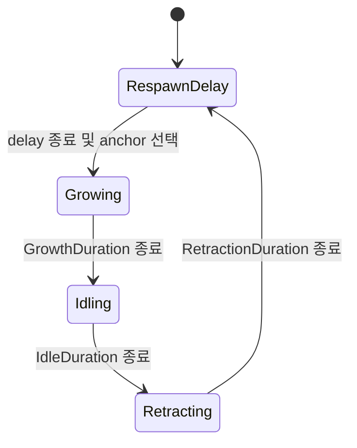

기본값은 다음과 같다.

| 설정 | 기본값 |
| --- | ---: |
| `TentacleCount` | 4 |
| `MinimumSampleDistance` | 20 cm |
| `SplinePointCount` | 5 |
| `TentacleLength` | 90 cm |
| `WaveAmplitude` | 22 cm |
| `WaveCycles` | 1.5 |
| `WaveSpeed` | 2.4 |
| `TentacleWidth` | 0.6 |
| `GrowthDuration` | 0.65초 |
| `IdleDuration` | 1.8초 |
| `RetractionDuration` | 0.45초 |
| `RespawnDelayRange` | 0.25~0.8초 |

`TentacleLength=90cm`는 초기 180cm 요구값에서 절반으로 조정된 값이다.

### 9.7 타겟 메시 표면 휘감기 촉수

`UCMChimeraWrapTentacleComponent`는 각 몸통 presentation에 고정 소유된다. 초기화할
때 presentation과 1:1로 연결된 `BodyMesh_n`의 직접 자식 TORSO를 자동 탐색해 타깃으로
설정하므로 별도 Event Graph 배선 없이 실제 플레이에서 동작한다. 필요하면 이후
`Set Wrap Tentacle Target`에 외부 `StaticMeshComponent` 또는 `SkeletalMeshComponent`를
전달해 타깃을 교체할 수 있다. 이 기능은 기존 `TentacleActor`의 파츠 예약·당기기
판정과 상태를 공유하지 않는 로컬 cosmetic이다.

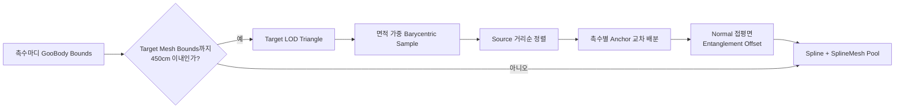

근접 판정은 Target Actor 원점이 아니라 `TargetMesh->Bounds.GetBox()`와 촉수마디
표면 bounds 중심 사이의 최단거리로 계산한다. 오리진이 실제 메시에서 떨어진
분리형 파츠나 큰 메시도 실제 렌더 bounds에 가까워졌을 때 올바르게 활성화된다.

타깃 표면 후보는 선택한 LOD의 모든 유효 triangle을 면적 가중치로 샘플링한다.
최소 간격을 통과한 첫 후보는 소스에서 가까운 순으로 고른다. 다음 후보는 직전
anchor에 가장 가까우면서 surface normal이 반대 방향이 아닌 점을 선택한다. 따라서
얇은 외피의 반대편 표면으로 건너가는 직선 경로 대신 연속된 로컬 surface path를
형성한다. 촉수마다 `SplinePointCount - 1`개의 표면 anchor를 가진다.

Static Mesh anchor는 target-local 위치와 normal을 저장한다. Skeletal Mesh는 샘플
시점의 CPU-skinned 위치에 가장 가까운 bone을 찾고, bone-local 위치와 normal도
저장한다. 매 프레임 vertex buffer 전체를 다시 읽지 않고 현재 bone transform으로
anchor를 복원하므로 애니메이션과 래그돌 pose를 계속 따라간다.

렌더링은 경유점마다 짧은 `SM_VFX_Arm_03`을 반복하지 않는다. 각 경유점에 8각 ring을
만들고 인접 ring 사이의 정점을 하나의 procedural mesh section으로 연결한다. 촉수
하나는 하나의 연속된 tube이므로 접합 단면이나 개별 파츠 사이의 틈이 없으며,
`MI_VFX_Goo_Arm_01` 머티리얼과 누적 길이 UV를 사용한다.

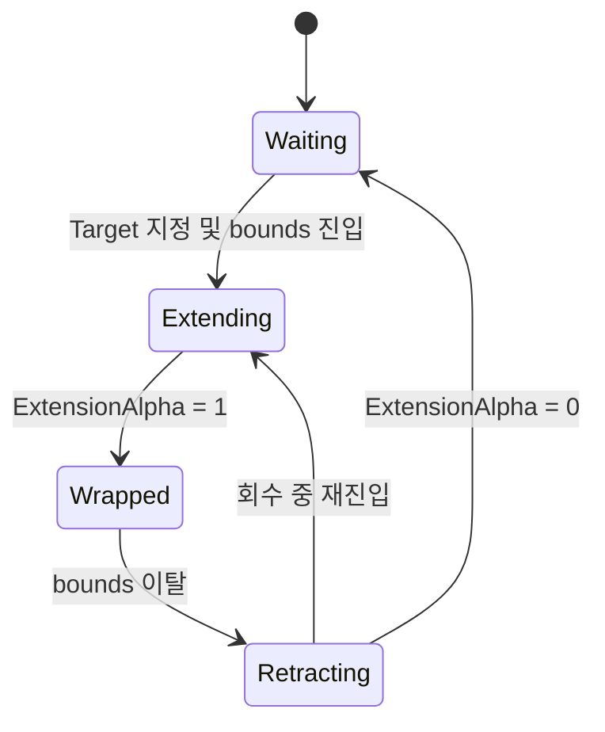

전개 중에는 point별 reveal alpha를 사용한다. 앞쪽 point가 먼저 target anchor에
도달하고 다음 point가 이어서 이동하므로 전체 spline이 순간 점멸하지 않고
촉수마디에서 타깃 표면을 향해 자란다. 회수는 같은 alpha를 반대로 진행한다.
각 anchor에는 surface normal 방향의 `SurfaceOffset`과 접평면의 사인/코사인 굴곡을
더하며 `Entanglement`, `EntanglementAmplitude`, `EntanglementCycles`로 Blueprint에서
엉키는 정도를 조정한다.

기본값은 다음과 같다.

| 설정 | 기본값 |
| --- | ---: |
| `TentacleCount` | 3 |
| `SplinePointCount` | 32 |
| `ActivationDistance` | 450 cm |
| `ExtensionDuration` | 1.2초 |
| `RetractionDuration` | 0.8초 |
| `MinimumTargetAnchorDistance` | 2 cm |
| `TentacleWidth` | 0.25 |
| `Entanglement` | 0.0 |
| `EntanglementAmplitude` | 30 cm |
| `EntanglementCycles` | 1.5 |
| `SurfaceOffset` | 2 cm |

선택한 Target LOD는 런타임 CPU 접근이 가능해야 한다. 현재 구현은 목표 기능의 첫
수직 슬라이스로, 메시의 UV seam이나 topology 연결성을 계산하는 geodesic solver는
아니다. 최종 모델에서 경로가 분리된 island를 가로지르는 경우 baked adjacency 또는
collision proxy를 추가하는 후속 품질 작업이 필요하다.

## 10. 키메라 이동 궤적

### 10.1 소유권과 생성 위치

`UCMChimeraTrailComponent`는 `ACMChimera`의 native default subobject다. 네트워크로
복제하지 않는 로컬 cosmetic이며 Dedicated Server에서는 tick을 끈다.

단일 Head 위치를 사용하지 않는다. 매 tick 현재 `ActiveSegmentCount`를 읽고 각
`BodyMesh_n`의 위치마다 독립된 `FSourceState`를 유지한다. 활성 마디가 8개이면
8개 위치에서 동시에 지면 흔적을 만든다.

### 10.2 거리 기반 스탬프 계획

시간 간격이 아니라 각 마디의 누적 평면 이동거리를 사용한다.

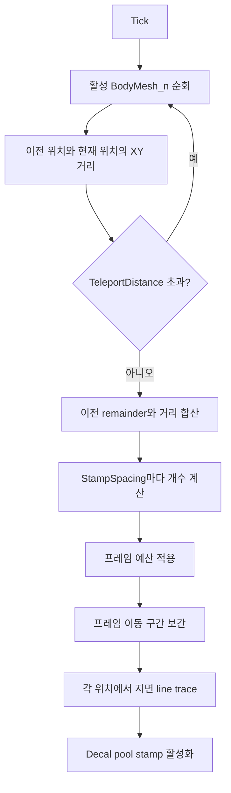

프레임 간 이동이 `StampSpacing`보다 길어도 시작점과 끝점 사이를 보간해 중간
스탬프를 채운다. 예산을 초과한 경우 오래된 구간을 건너뛰고 최신 경로를 우선한다.
순간이동으로 판정되면 중간 전체를 칠하지 않고 이동 샘플을 초기화한다.

### 10.3 지면 투영 좌표계

각 보간 지점에서 위·아래 방향 line trace를 수행한다.

1. `ImpactNormal`을 안전하게 정규화한다.
2. 이동 방향을 표면 평면에 투영해 tangent를 만든다.
3. 데칼 local X축을 표면 normal에 맞춘다.
4. 데칼 local Z축을 표면 tangent에 맞춘다.
5. 충돌점에서 normal 방향으로 `SurfaceOffset`만큼 띄운다.

이 좌표계는 경사면에서도 projection depth가 표면을 향하고 브러시의 진행축이 이동
방향을 따르도록 한다. tangent가 퇴화하면 normal과 Right Vector의 cross product,
마지막으로 Forward Vector를 fallback으로 사용한다.

### 10.4 CMGore와 분리된 전용 머티리얼

초기 시도에서는 CMGore Blood Definition이 사용하는 6-plane 또는 blood pool
머티리얼에 텍스처만 교체했다. 그러나 해당 셰이더는 월드 프로젝션, 면 분기,
`Growth`, 높은 `Opacity` 스케일을 자체 해석하므로 작은 바닥 데칼에 텍스처 일부가
줄무늬처럼 잘리거나 파라미터 적용 직후 마스크가 사라졌다.

현재는 키메라 전용 `M_CMChimeraTrailDecal`을 사용한다.

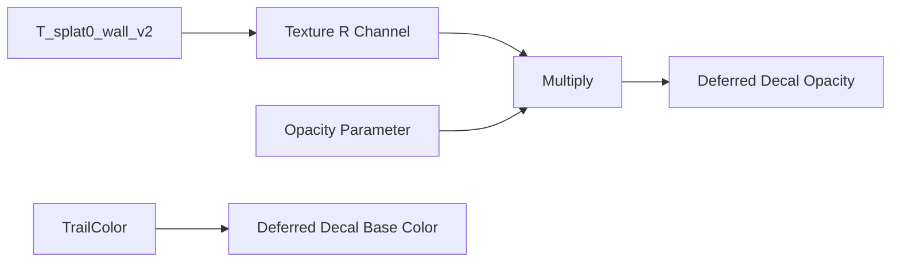

전용 머티리얼에는 다음 복잡성이 없다.

- CMGore Blood Definition 참조
- 6-plane 또는 world-position UV projection
- Floor/Wall texture 분기
- `Growth` 마스크
- 파츠 혈흔용 presentation 진행도

`BrushTexture.R * Opacity`가 데칼 opacity에 직접 연결되므로 지정한
`T_splat0_wall_v2`의 흰색 패턴이 그대로 브러시 모양이 된다.

### 10.5 스탬프별 MID와 수동 fade

모든 스탬프가 하나의 MID를 공유하면 서로 다른 수명 진행도를 표현할 수 없다.
따라서 decal pool 인덱스마다 MID를 lazy 생성하고 각각의 `Opacity`를 갱신한다.

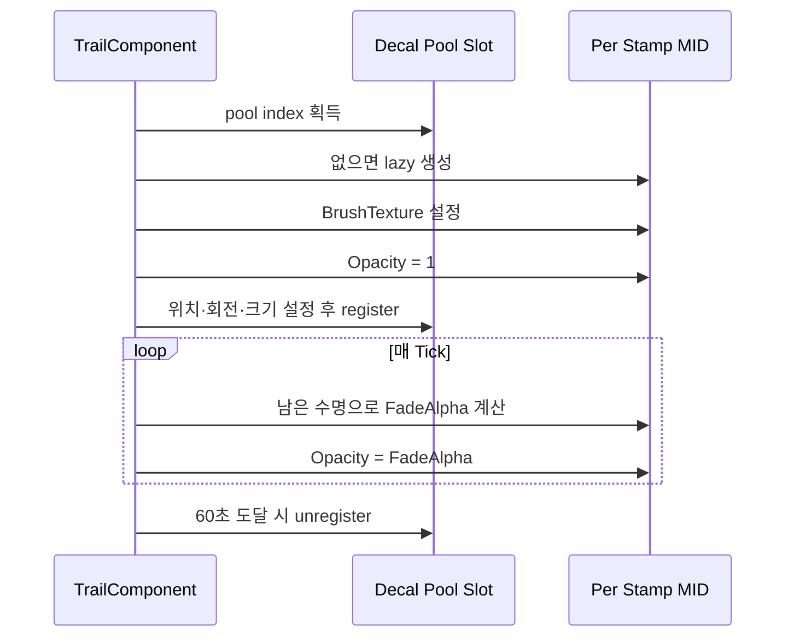

기본 수명은 60초다. 첫 40초는 `Opacity=1`을 유지하고 마지막 20초 동안 남은
수명에 비례해 1에서 0까지 선형으로 감소시킨다. 원본 머티리얼이
`DecalLifetimeOpacity`를 지원하는지에 의존하지 않도록 Unreal 내장 `SetFadeOut`은
사용하지 않는다.

### 10.6 기본 설정

| 설정 | 기본값 | 의미 |
| --- | ---: | --- |
| `StampSpacing` | 45 cm | 마디별 이동거리 스탬프 간격 |
| `TrailWidth` | 37.5 cm | 브러시 가로 크기 |
| `StampLength` | 37.5 cm | 정사각형 텍스처 비율을 위한 세로 크기 |
| `DecalDepth` | 16 cm | 표면 투영 깊이 |
| `Lifetime` | 60초 | 전체 흔적 수명 |
| `FadeDuration` | 20초 | 수명 말기의 alpha fade 구간 |
| `TrailOpacity` | 1.0 | 새 스탬프 기본 alpha |
| `PoolCapacity` | 8192 | 8개 마디의 장시간 흔적을 위한 decal slot 수 |
| `MaxStampsPerFrame` | 64 | 순간적인 생성 폭증 제한 |
| `TeleportDistance` | 500 cm | 한 프레임 이동을 순간이동으로 보는 기준 |
| `TraceHeight` | 120 cm | 샘플점 위 trace 시작 거리 |
| `TraceDepth` | 300 cm | 샘플점 아래 trace 종료 거리 |
| `SurfaceOffset` | 1.5 cm | z-fighting 방지 표면 오프셋 |
| `TraceChannel` | `ECC_Visibility` | 지면 검출 채널 |

## 11. 네트워크와 수명주기 경계

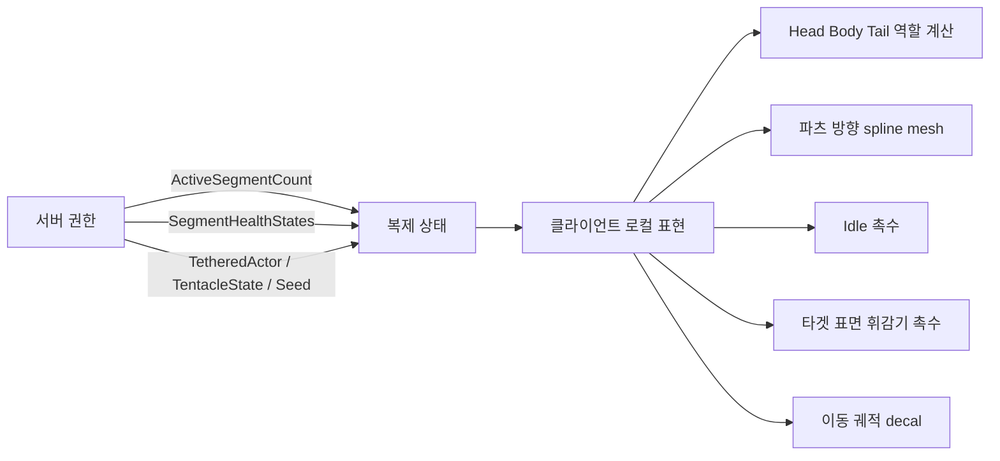

| 기능 | 실행 위치 | 복제 여부 |
| --- | --- | --- |
| 활성 마디 수와 역할 입력 | 서버 결정 후 복제 | `ActiveSegmentCount` 복제 |
| 마디 체력·사망 | 서버 | 기존 상태 복제 |
| 파츠 후보·예약·당기기 | 서버 | 타겟과 상태 복제 |
| 파츠 방향 spline mesh | 클라이언트 | 결과 상태만 사용 |
| Idle 촉수 | 클라이언트 | 복제하지 않음 |
| 타겟 표면 휘감기 촉수 | 클라이언트 | 기본 TORSO는 presentation이 자동 연결, VFX 결과는 복제하지 않음 |
| 이동 궤적 decal | 클라이언트 | 복제하지 않음 |

Idle, 휘감기, 궤적은 gameplay 판정에 영향을 주지 않는다. 이 때문에 네트워크 Actor나
대량의 replicated component를 만들지 않고 각 화면에서 로컬로 재구성한다.

## 12. 추가된 파일

### 12.1 C++ 소스

| 파일 | 책임 |
| --- | --- |
| `Source/Chimera/Player/CMChimeraBodySegmentActor.h/.cpp` | 마디 presentation, 역할 계산, BodyVisual/TentacleActor/IdleTentacles 소유 |
| `Source/Chimera/Player/CMChimeraVisualDefinition.h/.cpp` | 역할별 메시 프리셋과 Skeleton·Sampling·Physics 자동 검증 |
| `Source/Chimera/Player/CMChimeraIdleTentacleComponent.h/.cpp` | Skeletal/Static 표면 샘플러, spline·mesh pool, 생성·대기·수축 애니메이션 |
| `Source/Chimera/Player/CMChimeraWrapTentacleComponent.h/.cpp` | Static/Skeletal 타깃 표면 샘플링, 거리순 anchor, pose 추종, 근접 전개·회수 spline pool |
| `Source/Chimera/Player/CMRuntimeChildActorComponent.h/.cpp` | Editor preview에서 중첩 ChildActor 생성을 차단하고 Game World에서만 생성 |
| `Source/Chimera/Player/CMChimeraTrailComponent.h/.cpp` | 활성 마디별 거리 누적, 지면 trace, decal pool, 전용 MID alpha fade |

### 12.2 자동화 테스트

| 파일 | 주요 검증 |
| --- | --- |
| `Source/Chimera/Tests/CMChimeraBodySegmentTests.cpp` | 역할·정의·Idle 계약, 휘감기 진행률과 bounds 판정, 실제 Static Mesh spline pool |
| `Source/Chimera/Tests/CMChimeraTrailTests.cpp` | 거리 누적, 예산 제한, 순간이동, normal/tangent 축, 전용 머티리얼, texture parameter, 수명·fade |

### 12.3 콘텐츠와 문서

| 파일 | 책임 |
| --- | --- |
| `Content/Chimera/Character/Chimera/Blueprint/BP_CMChimeraBodySegment.uasset` | 마디 presentation Blueprint와 authoring 확장점 |
| `Content/Chimera/Character/Chimera/Materials/M_CMChimeraTrailDecal.uasset` | 키메라 궤적 전용 단순 Deferred Decal 셰이더 |
| `Docs/Chimera_Visual_Reinforcement_Implementation_Contract.md` | 전체 모델링·애니메이션·VFX 계약과 단계별 기준선 |
| `Docs/Chimera_Visual_Reinforcement_Implementation_Report.md` | 현재 구현 파일과 원리를 설명하는 본 문서 |

## 13. 변경된 파일

| 파일 | 변경 내용 |
| --- | --- |
| `Source/Chimera/Player/CMChimera.h/.cpp` | presentation class와 배열, TrailComponent, 고정 presentation 생성, 활성 상태 동기화, Blueprint 크래시 방지 경로 추가 |
| `Source/Chimera/Player/CMChimeraBodySegmentActor.h/.cpp` | 고정 WrapTentacles 소유, 촉수마디 소스 연결, Blueprint 타깃 설정 API, 활성 상태 동기화 |
| `Source/Chimera/Player/CMChimeraPhysics.cpp` | 물리 구성 이후 presentation/Tentacle 상태 refresh 연결 |
| `Source/Chimera/Parts/Tentacle/CMTentacleSegmentActor.h/.cpp` | 고정 활성화 API, GooBody, runtime spline mesh, 실제 PartMesh 표면 목표점, 두꺼운 파츠 촉수, Niagara 부착 |
| `Source/Chimera/Tests/CMTentacleAttachmentTests.cpp` | Blueprint 콘텐츠, 고정 마디 통합, spline mesh 렌더, 파츠 pull 회귀 검증 확장 |
| `Content/Chimera/Character/BP_CMChimera.uasset` | 손상된 Blueprint 상태 복구 및 presentation 연결 호환 처리 |
| `Content/Vefects/Tentacles_VFX/VFX/Goo/SM/SM_VFX_Smooth_Sphere_01.uasset` | Static Mesh 표면 CPU 샘플링 가능 설정과 촉수마디 소스 구성 |

현재 작업 트리는 `CMTentacleSegmentActor.cpp`를 수정 상태로 표시하지만 HEAD blob과
worktree blob이 같고 `git diff` 내용은 없다. 따라서 본 문서에서는 별도의 미커밋
기능 변경으로 계산하지 않는다.

## 14. 자동화 및 실행 검증

구현 과정에서 확인한 테스트 기준선은 다음과 같다.

| 필터 | 확인 결과 | 보장 범위 |
| --- | ---: | --- |
| `Chimera.BodySegment` | 5/5 성공 | 역할, Visual Definition, Idle, Wrap 수학·소유·Static Mesh 런타임 pool |
| `Chimera.Tentacle` | 3/3 성공 | 기존 부착 기능과 Blueprint 통합 |
| `Chimera.Multiplayer.ControlAssignments` | 2/2 성공 | 기존 슬롯·조작 할당 회귀 |
| `Chimera.Animation.Part` | 2/2 성공 | 기존 파츠 애니메이션 회귀 |
| `Chimera.VFX.Trail` | 3/3 성공 | 궤적 계획, ownership, 실제 transient world decal pool |

추가로 다음을 확인했다.

- `ChimeraEditor Win64 Development` 빌드 성공
- `BP_CMChimera` 실제 Editor open 후 300 frame 안정성 확인
- 전용 decal 머티리얼 컴파일 오류 없음
- 100cm 이동 시 45cm 간격의 두 스탬프 생성
- 경사면에서 decal local X와 surface normal 일치
- decal local Z와 표면에 투영한 movement tangent 일치
- 새 스탬프 `Opacity=1`, fade 중간 `Opacity=0.5`
- Engine Sphere Static Mesh 표면에서 연결형 procedural tube 2개 생성·가시성 유지
- 실제 `BP_CMChimera`의 16개 마디가 16개의 고유 TORSO에 1:1 연결됨
- 렌더링 환경에서 활성 TORSO에 서로 분리되지 않은 procedural tube 촉수 3개 생성·가시성 유지

자동화 테스트는 NullRHI 환경의 구조와 수치 검증이다. 최종 모델, 조명, 바닥 재료,
DBuffer 설정이 들어간 실제 PIE 장면에서의 시각 품질 검수는 별도로 필요하다.

## 15. 현재 완료 경계와 다음 페이즈

### 15.1 완료로 볼 수 있는 항목

- 물리 마디와 시각 마디의 분리
- Head/Body/Tail 역할별 확장 구조
- 마디 Blueprint가 TentacleActor를 제작 시점부터 소유하는 구조
- 역할별 메시 Data Asset 타입과 임포트 validation
- Static/Skeletal 표면 샘플링 공용 Idle 컴포넌트
- 촉수마디당 네 개의 반복 Idle spline 촉수
- 래그돌 파츠의 실제 Skeletal Mesh 표면을 향하는 연결 촉수
- Static/Skeletal 타깃 메시 표면의 거리순 anchor를 감는 다중 촉수 수직 슬라이스
- 활성 마디별 이동 궤적과 전용 브러시 셰이더
- 장시간 수명과 스탬프별 alpha fade
- Blueprint Editor 재귀 크래시 방지

### 15.2 다음 구현 순서

1. **하부 무수한 팔 Niagara**
   - `UnderbodyArms` 방출 위치 연결
   - 이동 속도별 spawn rate와 reach
   - 마디 비활성·사망 시 정리와 scalability
2. **Death 외피 래그돌**
   - shell 세 조각 분리와 impulse
   - core 심지 유지
   - 클라이언트 cosmetic 결과와 상태 전환
3. **IK/Control Rig**
   - Head 팔·촉수 날개의 secondary motion
   - Planted 사지의 기존 Leg IK 수학 재사용
   - Dragged 사지의 지면 추종·관성 solver

### 15.3 후속 작업에서 유지할 불변 조건

- `BodyMesh_n` 물리 프록시와 슬롯 주소를 시각 메시로 대체하지 않는다.
- Head/Body/Tail 역할 때문에 별도 체력이나 슬롯 타입을 만들지 않는다.
- 로컬 cosmetic VFX를 불필요하게 복제하지 않는다.
- 플레이어 수 변경 시 presentation과 TentacleActor를 Spawn/Destroy하지 않는다.
- 최종 메시가 크게 변형되는 경우 Idle anchor의 triangle-to-bone 추종 여부를 실제
  리그에서 검증한 뒤 확장한다.
- 궤적 머티리얼을 다시 CMGore Blood Definition에 결합하지 않는다.
