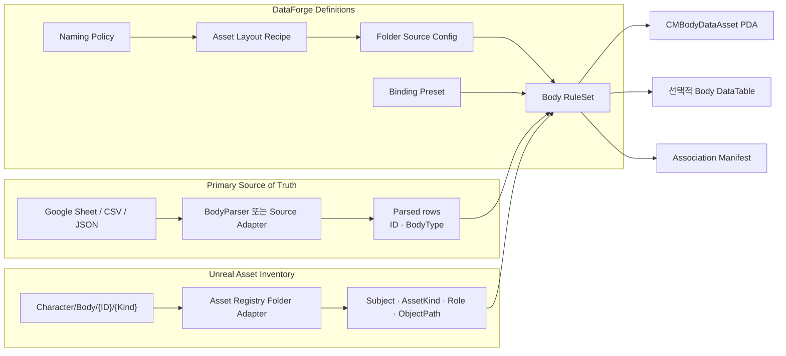
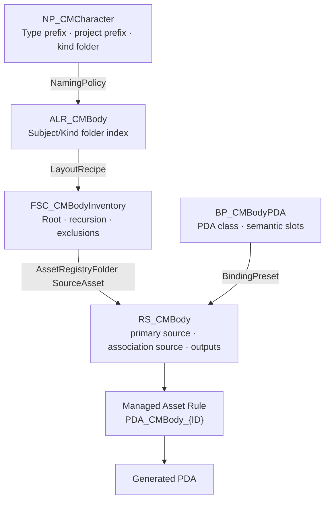
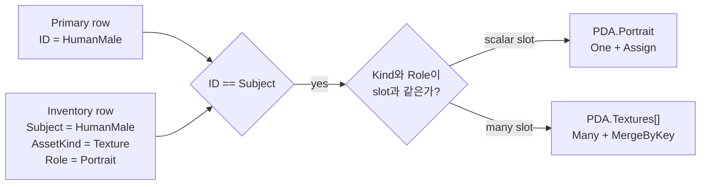
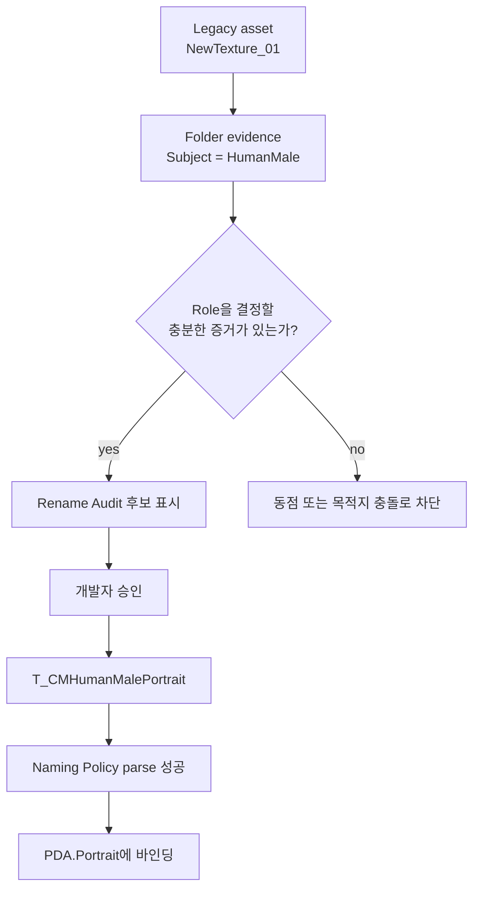
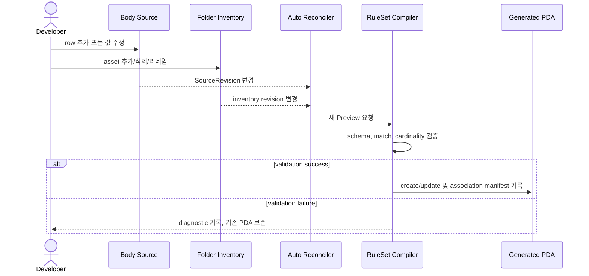

# DataForge 플러그인 설계 문서

대상 버전: DataForge 1.5

## 1. 목적

DataForge는 CSV, JSON, Google parser 및 프로젝트 전용 parser의 결과를 Unreal 에셋으로 변환하는 Editor 전용 자동화 프레임워크다. Parser 구현과 Unreal 에셋 생성 로직을 분리하며 모든 입력을 canonical `FDataForgeDataSet`으로 정규화한다.

```text
Raw CSV / JSON / Existing Parser / Provider Cache
                         ↓ IDataForgeSourceAdapter
                  FDataForgeDataSet
                         ↓ UDataForgeRuleSet
       DataTable + Managed DA/PDA + External Asset References
```

게임 런타임은 외부 소스에 접근하지 않고 Editor에서 생성된 Unreal 에셋만 소비한다.

## 2. 핵심 원칙

- Parser 독립성: Compiler는 CSV나 Google Sheet 구현을 알지 못한다.
- Preview 우선: 모든 Apply는 동일 상태에 대한 성공한 Preview를 요구한다.
- 결정성: 같은 Source와 RuleSet은 같은 행 이름, 경로 및 값을 만든다.
- 소유권 분리: Managed 에셋만 생성·이동·추적하며 External 에셋은 참조만 한다.
- Source of Truth: 소스·스키마·관리 대상 변경은 새 Preview와 Apply로 수렴한다.
- 안전한 최초 생성: MCP는 범용 property 편집 대신 하나의 고수준 부트스트랩을 사용한다.

## 3. 모듈

### DataForgeCore

- `UDataForgeRuleSet` 및 직렬화 타입
- CSV/JSON Adapter와 Adapter Registry
- RuleSet compiler, validation 및 apply plan
- DataTable/DA/PDA materialization
- Source/target revision과 drift 검사

### DataForgeEditor

- Creation Wizard와 RuleSet Editor
- 바인딩·경로·Source customization
- Project Overview, snapshot, recovery 및 commandlet
- `FDataForgeAutoReconciler`

### ChimeraEditor 통합

- Google Sheet Cache Adapter
- Multi Source left join Adapter
- Google cache 갱신 이벤트 연결
- DataForge MCP 부트스트랩 명령

DataForgeCore는 GoogleSheetLoader에 의존하지 않는다. 프로젝트 통합 모듈이 provider를 Adapter로 연결한다.

## 4. Source Adapter 계약

```cpp
class IDataForgeSourceAdapter
{
public:
    virtual FDataForgeSourceDescriptor Describe() const = 0;
    virtual bool Probe(const FDataForgeSourceConfig&, FDataForgeDataSet&, TArray<FDataForgeDiagnostic>&) const = 0;
    virtual bool Fetch(const FDataForgeSourceConfig&, FDataForgeDataSet&, TArray<FDataForgeDiagnostic>&) const = 0;
};
```

Adapter는 다음을 보장한다.

- 안정적인 column 순서와 이름
- canonical string value map으로 구성된 row
- source row 위치
- 입력 전체를 대표하는 결정적 `SourceRevision`

기본 Adapter는 CSV와 JSON이며 프로젝트 Adapter로 Google Sheet Cache와 Multi Source가 등록된다. Multi Source의 첫 입력이 행 집합을 결정하고 이후 입력은 각 `JoinColumn`을 기준으로 left join된다. 입력 수에는 1개 외의 제한이 없다.

## 5. RuleSet 모델

`UDataForgeRuleSet`은 다음 설정을 소유한다.

- `Source`: Adapter, File/Source Asset, Multi Source Inputs
- `Schema`: Primary Key, Required Columns
- `Output`: Row Struct, DataTable package path 및 저장 정책
- `AssetRules`: External 조회 또는 Managed 생성 경로 규칙
- `GeneratedOutputs`: DA/PDA 클래스와 Managed Asset Rule 연결
- `Bindings`: Source/Generated Output에서 row 또는 생성 에셋 속성으로의 값 전달
- `Dependencies`: 먼저 Preview/Apply할 RuleSet

Asset Rule의 `{ColumnName}` 토큰은 대소문자를 구분한다. Managed 에셋의 안정적인 ID는 `(RuleSetId, RecordId, OutputName)`이며 실제 package에는 DataForge metadata가 기록된다.

## 6. 바인딩 추론

Auto Map은 다음 관계를 중복 없이 생성한다.

1. Source column → 같은 이름의 editable DataTable row property
2. Source column → 같은 이름의 editable Generated Output property
3. Generated Output → 같은 이름의 DataTable soft-object property

Texture, Mesh처럼 경로 규칙이 필요한 값은 `ResolvedAsset`과 External Asset Rule을 사용한다. Generated Output 삭제나 이름 변경 시 해당 Output을 참조하는 무효 바인딩만 정리하며 유효한 수동·중첩 property 바인딩은 보존한다.

## 7. Creation Wizard

Wizard는 실제 RuleSet이 아닌 transient draft를 편집한다.

```text
Source → Probe → Schema → Output
       → Asset Layout → Asset Rules → Generated Outputs → Bindings → Preview
```

- 각 단계에는 해당 설정만 표시한다.
- Asset Rule을 먼저 정의한 뒤 Generated Output에서 Managed Rule을 드롭다운으로 선택한다.
- Generated Output 변경은 바인딩을 즉시 동기화한다.
- Automatic Setup은 Primary Key, folder layout, PDA/DA reflection slot, cardinality, association 및 exact-name binding을 mutation 없이 계획한다.
- Asset Search Root와 정확히 일치하는 기존 `Folder Source Config → Asset Layout Recipe → Naming Policy` 체인은 재사용한다. 동률 후보는 임의 선택하지 않는다.
- Preview review는 추론 근거, 생성/재사용 파일, 할당 관계, diagnostic 및 실제 row/asset effect를 표시한다.
- Automatic Setup은 성공한 Preview 뒤 개발자의 명시적 승인이 있어야 `Finish & Apply`할 수 있다. Draft 변경 또는 Preview 재실행은 승인을 무효화한다.
- `Finish & Apply`에서만 transient definition을 승격하고 draft를 RuleSet에 복사한 뒤 새 Preview와 Apply를 수행한다.

## 8. Source of Truth 재조정

`FDataForgeAutoReconciler`는 Editor 이벤트를 RuleSet 단위 요청으로 합친다.

- CSV/JSON: Directory Watcher가 실제 source file 변경을 감지
- Google: normalized cache 갱신 event가 해당 config를 참조하는 RuleSet만 즉시 처리
- RuleSet/DataTable/Managed/External asset: property 및 Asset Registry event 감지
- Row Struct/Generated class: object reinstancing 및 reload 완료 감지

일반 Editor 이벤트는 짧은 debounce로 합치며 동일 RuleSet의 중복 요청은 한 번만 처리한다. Apply 중 재진입을 막고 DataForge가 방금 기록한 package event를 일시적으로 억제한다. 자동 재조정도 항상 새 Preview에 성공한 경우에만 Apply한다.

## 9. 스키마 변화 안전성

다음 변화를 정상적으로 처리하거나 mutation 전에 diagnostic으로 차단한다.

- Source row 추가: 기존 DataTable과 Generated Output에 새 record 추가
- Source column/Row Struct/Generated class 확장: 새 정확 이름 바인딩과 property 적용
- 기존 DataTable RowStruct 불일치 또는 누락: Preview 실패
- Generated Output class 누락: Preview 실패
- null UObject/property chain: diagnostic을 반환하고 Editor crash 방지

## 10. Preview, Apply 및 복구

Preview는 mutation 없이 row/asset create, update, move, unchanged, orphan 수를 계산한다. Apply 직전에 Source, RuleSet, DataTable 및 Managed asset revision을 다시 검사한다.

Apply는 orphan을 자동 삭제하지 않는다. `Cleanup Root Orphans` 또는 commandlet의 명시적 cleanup만 DataForge ownership을 재검증한 뒤 삭제한다. 변경 전 DataTable JSON과 property 변경은 `Saved/DataForge/Recovery` manifest에 기록한다.

## 11. MCP 최초 생성

단순 Google→DataTable 요청:

```text
DataForge.MCP.CreateRuleSetFromGoogleParser Config=/Game/Data/GS_Items
```

Managed/External 에셋과 명시적 바인딩이 있는 요청:

```text
DataForge.MCP.CreateRuleSetFromGoogleParser Spec=Saved/DataForge/McpRequests/items.json
```

Spec 전체를 파싱·검증한 뒤 Probe, schema 추론, exact-name binding, Preview 및 Apply를 수행한다. 기존 RuleSet은 덮어쓰지 않는다. 상세 계약은 `Docs/DataForge_MCP_Guide.md`에 정의한다.

## 12. 검증과 운영

- 전체 validation: `UnrealEditor-Cmd.exe Chimera.uproject -run=DataForge -All -ValidateOnly`
- Profile drift CI: 위 명령에 `-FailOnOutdatedProfiles`
- Profile batch rebase preview: `-Profile=/Game/.../ALP_Name -Rebase -ValidateOnly`
- 명시적 Profile batch apply: `-Profile=/Game/.../ALP_Name -Rebase -Apply`
- 변경 감지 CI: 위 명령에 `-FailOnChanges`
- 단일 Apply: `-RuleSet=/Game/.../RS_Name -Apply`
- 전체 자동화 테스트: `Automation RunTests DataForge`

Project Overview에서 RuleSet, source/provider, output, dependency 및 실행 순서를 확인한다. Source file, RuleSet, snapshot과 생성 결과는 같은 변경 단위로 검토한다.

## 13. 폴더 기반 연관과 리네임 안전성

폴더 자동화는 `Naming Policy -> Asset Layout Recipe -> Folder Source Config -> Binding Preset` 계층으로 구성된다. Folder Adapter는 Asset Registry 결과를 `FDataForgeDataSet`으로 정규화하므로 primary CSV/JSON/Google source와 association source가 같은 compiler 계약을 유지한다.

Binding Preset slot은 `AssetKind`, `Role`, `ExpectedAssetClass`, cardinality와 reconcile mode를 선언한다. `One`과 `OptionalOne`은 단일 참조를, `Many`는 배열 참조를 처리하며 `ReplaceManaged`와 `MergeByKey`는 Association Manifest가 소유하는 경로만 변경한다.

Rename Audit는 후보를 다음 증거로 평가한다.

```text
Existing Association Manifest   1000
Exact current conventional name  300
Subject folder = source key       250
Naming Policy parse success       200
```

점수는 선택을 설명하기 위한 결정적 우선순위이며 확률이 아니다. slot별 유일 최고점만 Recommended가 되고, 동점과 무근거 후보는 mutation 대상이 되지 않는다. 일괄 적용 직전에는 source asset, RuleSet, source row, destination과 batch 내부 충돌을 다시 검사한다.

## 14. 리네임 복구 상태 기계

리네임과 복원은 AssetTools 호출 전에 원자적 JSON 매니페스트를 기록한다.

```text
Planned -> Succeeded -> Restored
       \-> FailedRolledBack
       \-> FailedRollbackIncomplete -> Recovery Center restore
```

원본 리네임 매니페스트는 `Rename_*.json`, 역방향 복원 작업은 `Restore_*.json`이다. 배치 실패 시 UObject의 실제 현재 경로를 검사해 이미 이동된 항목만 역연산한다. 복구는 모든 경로가 명확할 때만 실행되며 부분 실패 역시 원래 복원 전 경로로 rollback을 시도한다.

매니페스트는 에셋의 바이너리 사본이 아니라 경로 연산과 감사 기록이다. 따라서 삭제 복구와 이력 보존의 최종 책임은 source control에 있다.

## 15. BodyParser에서 PDA와 폴더 에셋을 결합하는 참조 설계

Body 자동화는 primary parsed data와 Unreal asset inventory를 서로 다른 Source of Truth로 취급한다. BodyParser는 "어떤 Body 레코드가 존재하는가"를 결정하고, Folder Adapter는 "어떤 Unreal 에셋이 존재하는가"를 결정한다. RuleSet compiler는 Binding Preset의 semantic slot을 기준으로 두 데이터 집합을 결합한다.



### 15.1 레코드 식별과 권장 폴더 경계

한 RuleSet이 여러 Body 레코드를 생성한다면 각 레코드의 primary key를 폴더 경계로 노출해야 한다.

```text
/Game/Chimera/Character/Body
├─ HumanMale                  # Subject = HumanMale
│  ├─ Texture                 # AssetKind = Texture
│  ├─ Material
│  ├─ Mesh
│  └─ Niagara
├─ HumanFemale               # Subject = HumanFemale
│  └─ {Texture,Material,Mesh,Niagara}
└─ Generated                 # Folder Source에서 제외
```

이 구조에서 Folder Source Root는 `/Game/Chimera/Character/Body`, `SubjectFolderIndex=0`, `KindFolderIndex=1`이다. Primary row의 `ID=HumanMale`과 inventory row의 `Subject=HumanMale`이 결합 키가 된다.

Body 레코드가 정확히 하나이고 primary key도 `Body`라면 `/Game/Chimera/Character/Body/{Kind}` 구조를 사용할 수 있다. 이때 Root는 `/Game/Chimera/Character`다. 반대로 여러 primary row가 하나의 `Body/Texture` 폴더를 공유하면 에셋 소유 레코드를 결정할 정보가 없으므로 자동 연결하지 않는다.

### 15.2 정의 에셋 의존성



Naming Policy는 다음 identity를 빌드하고 파싱한다.

```text
<TypePrefix>_<ProjectPrefix><Subject><Role>_<Numbering>
```

예를 들어 `T_CMHumanMalePortrait`은 `AssetKind=Texture`, `Subject=HumanMale`, `Role=Portrait`로 정규화된다. `T_CMHumanMaleTexture_2`는 같은 Subject의 `Texture` 역할 배열에 참여하며 `Numbering=2`를 보존한다.

### 15.3 association match와 cardinality



`One`과 `OptionalOne`은 단일 soft-object property를 요구한다. `Many`는 soft-object array를 요구하고 `Assign`을 사용할 수 없다. `ReplaceManaged`는 배열의 DataForge 관리분을 현재 source와 일치시키며, `MergeByKey`는 이전 Association Manifest가 소유한 항목만 교체하여 개발자가 수동 추가한 항목을 보존한다.

### 15.4 불규칙한 최초 이름과 Rename Audit

Folder Adapter는 폴더에서 Subject를 얻을 수 있지만 임의의 이름 `NewTexture_01`만으로 Portrait, Mask 또는 일반 Texture 역할을 결정할 수 없다. Naming Policy parse가 실패한 inventory row는 `AssetKind`와 `Role`이 비어 있으므로 PDA association 대상으로 사용할 수 없다.



여러 불규칙 에셋이 같은 slot 목적지를 요구하면 DataForge는 `_1`, `_2`를 임의로 배정하지 않는다. 의미 있는 Role 또는 Numbering은 최초 감사에서 개발자가 확정해야 한다. 이름을 바꿀 수 없는 레거시 에셋은 `Subject,ObjectPath,AssetKind,Role` column을 가진 CSV/JSON association source로 명시적으로 연결할 수 있다.

### 15.5 갱신과 실패 원자성



리네임은 PDA association과 별도의 명시적 mutation이다. Rename Audit 승인 후 Asset Registry 변경이 새 Preview/Apply를 유발하며, 적용 직전 source row와 목적지 충돌을 다시 검사한다. 따라서 불규칙 이름의 최초 정리와 정상화된 에셋의 지속적 자동 바인딩을 분리한다.
