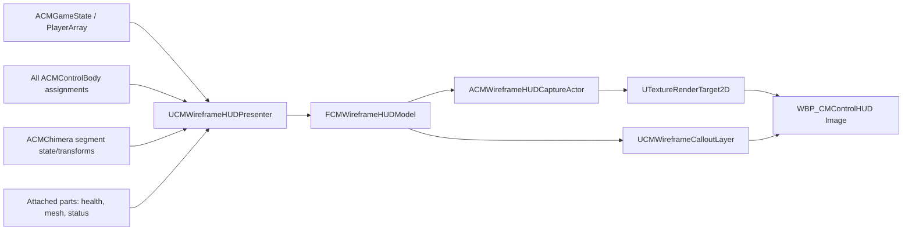

# 3D Wireframe HUD Architecture

## 1. Decision summary

The HUD remains a screen-space NKMUI/UMG widget, but its body map is replaced by a small local-only `SceneCapture2D` render panel. The capture renders scene-capture-only proxy meshes that copy the live Chimera segment transforms and attached-part poses. Callout dots, leader lines, and text remain Slate/UMG so that labels stay sharp, can be laid out against the viewport safe area, and do not need to be rendered as 3D text.

This split is intentional:

- 3D layer: body/part wireframe, per-item health color, destruction visibility.
- 2D layer: ownership labels, leader-line routing, status-name alternation, safe-area handling.
- presentation model: converts existing replicated gameplay state into stable HUD items. It is the only layer that understands ownership and status semantics.

The design does not add HUD-specific network replication. It consumes the replicated Chimera, ControlBody, PlayerState, part health, and part status state that already exists.

## 2. Assumptions

1. “플레이어 레벨” in the request means the callout **label**, not a numeric player level.
2. The requested literal color order is used: health `1.0 = red`, `0.0 = blue`. A destroyed body segment overrides the curve with black. Because the mapping is a curve asset, reversing it later is an asset edit.
3. A part’s owner is resolved from the physical `ACMControlBody::GetControlSlots()` assignment. Confusion and delirium may change effective input routing, but do not transfer ownership, so `GetEffectivePartSlotAddressForControlInput()` must not be used for the owner label.
4. “마비” is presentation text. The current runtime has `Chimera.State.Part.Electrified` and `Chimera.State.Part.Slowed`; the tag-to-text asset decides whether Electrified is displayed as “마비”.

## 3. Existing integration points

The current HUD already provides the correct event-driven foundation:

- `UCMControlHUDSubsystem` creates one local HUD per local player and pushes it to `NKM.UI.Layer.HUD`.
- `UCMControlHUDWidget` binds `OnControlSlotsChanged`, `OnSegmentStatesChanged`, `OnAttachedPartChanged`, and `OnHealthChanged`.
- `ACMPlayerState` already replicates player name, color, slot, and participation state.
- `UCMPartStatusComponent` already replicates active status tags and emits `OnStatusChanged` on both authority recalculation and `OnRep`.

The new feature should preserve the subsystem and replace only the body-map presentation inside `WBP_CMControlHUD`.

## 4. Runtime architecture



### Presentation model in `UCMControlHUDWidget`

The first implementation keeps presentation-model ownership in the existing `UCMControlHUDWidget` instead of adding another UObject lifecycle. It performs discovery, maintains stable callout items, and feeds the capture actor and Slate paint pass. Extract this into `UCMWireframeHUDPresenter` only if a second consumer appears.

```cpp
UENUM()
enum class ECMWireframeHUDItemKind : uint8
{
    BodySegment,
    AttachedPart
};

USTRUCT()
struct FCMWireframeHUDItem
{
    GENERATED_BODY()

    FName StableId;                         // Segment.3 or Part.3.1
    ECMWireframeHUDItemKind Kind;
    FCMPartSlotAddress SlotAddress;         // invalid for body-only data
    TWeakObjectPtr<USceneComponent> Anchor;
    TWeakObjectPtr<ACMPlayerState> Owner;
    TWeakObjectPtr<ACMPartActorBase> Part;
    float NormalizedHealth = 0.0f;
    bool bDestroyed = false;
    FGameplayTagContainer DisplayStatuses;
};
```

The widget owns delegate binding and presentation semantics. Render proxies do not reach back into player ownership or status-display policy.

### `ACMWireframeHUDCaptureActor`

A transient, non-replicated actor spawned only for the owning local player. It owns:

- `USceneCaptureComponent2D`
- transient `UTextureRenderTarget2D`
- one simple static-mesh proxy per active body segment
- one skeletal-mesh proxy per attached part
- one dynamic wireframe material per proxy

All proxy primitives use `SetVisibleInSceneCaptureOnly(true)`, have collision and shadows disabled, and are added to the capture’s ShowOnly list. UE 5.7 supports this flag directly, so proxies can stay aligned with the live assembly without appearing in the main game camera.

Body segments use a deliberately simple low-poly segment shell scaled from the source `UBoxComponent` extent. Attached-part proxies use the source skeletal mesh and `SetLeaderPoseComponent(SourcePartMesh)` so the captured wireframe follows the live pose without evaluating a second animation graph. Static or spline part types can add explicit adapters later; do not build a generic component-cloning framework before such a type exists.

### `UCMWireframeCalloutLayer`

A custom UMG/Slate layer above the render-target image. It owns pooled label widgets and draws all dots/leader-line polylines in one paint pass. Text stays in Slate, not in the render target.

### `UCMWireframeHUDStyleData`

A data asset referenced by the widget Blueprint:

```cpp
UPROPERTY(EditDefaultsOnly)
TSoftObjectPtr<UCurveLinearColor> HealthColorCurve;

UPROPERTY(EditDefaultsOnly)
FLinearColor DestroyedBodyColor = FLinearColor::Black;

UPROPERTY(EditDefaultsOnly)
TMap<FGameplayTag, FCMHUDStatusPresentation> StatusPresentation;
```

`FCMHUDStatusPresentation` contains localized display text, priority, and whether it applies to the whole owner label or only the owning part. Keep animation timing and line geometry in this same style asset so designers can tune the panel without changing C++.

## 5. Render path

### Capture and camera

Use an orthographic three-quarter view. It preserves readable scale while still showing depth through the wireframe. Every visible frame:

1. Copy body-segment world transforms and attached-part component transforms/poses to proxies.
2. Build the combined proxy bounds.
3. Smooth the capture origin toward the bounds center.
4. Smooth `OrthoWidth` to fit the bounds with a 12–15% margin.
5. Update material colors only for dirty health/destruction items.
6. Call `CaptureSceneDeferred()` once.
7. Project callout anchors with the same capture view-projection matrix.

Start at a 512×512 RGBA8 render target. Disable lighting, fog, particles, shadows, motion blur, temporal effects, and every show flag not needed by the unlit wireframe. Capture only while the HUD is visible. Measure before selecting 30 Hz or 60 Hz; transforms and labels still update every UI frame if capture is throttled.

### Wireframe material

Create `M_UI_ChimeraWireframe` as Unlit, Two Sided, and Wireframe. Its essential parameters are:

- `WireColor`
- `Opacity`
- optional `DepthFade` for readability

Each proxy owns a MID. Evaluate color as:

```cpp
const float T = FMath::Clamp(Health / MaxHealth, 0.0f, 1.0f);
const FLinearColor Color = bDestroyed && Kind == BodySegment
    ? Style->DestroyedBodyColor
    : Style->HealthColorCurve->GetLinearColorValue(T);
```

Recommended curve keys for the literal requirement:

- `0.0`: blue
- `0.5`: purple
- `1.0`: red

The curve must use linear interpolation for predictable health transitions. Alpha may control emissive intensity, but health meaning must remain in RGB.

## 6. Ownership resolution

Rebuild a physical-address ownership map when the roster or any ControlBody assignment changes:

```text
FCMPartSlotAddress -> ACMPlayerState
SegmentIndex       -> ACMPlayerState
```

Enumerate the replicated ControlBodies, take their PlayerState and original `GetControlSlots()`, then validate that no physical address has two owners. For a body segment, use `ACMControlBody::OwnsSegment()` because defeat-body ownership is intentionally independent from randomized control-slot ownership. If invalid data creates multiple owners, render a joined deterministic label and log once; never silently choose one.

Name text comes from `APlayerState::GetPlayerName()`. Player color may tint the dot/leader line, while the wireframe itself remains health-colored.

## 7. Leader-line layout

The label solver works in panel-local coordinates after DPI scaling. It receives anchor points, label desired sizes, the panel safe rectangle, and a silhouette exclusion rectangle/hull computed from the projected proxy bounds.

For each frame:

1. Project each body/part anchor into panel space.
2. Expand the projected silhouette by the configured label clearance.
3. Generate candidate slots on four rails around the silhouette: left, right, top, bottom.
4. Prefer the nearest outward rail, then assign remaining labels by stable ID while minimizing leader length and line crossings.
5. Pack intervals along each rail with minimum label spacing; overflow moves to the next-cheapest rail.
6. Clamp the final label rectangle to the viewport safe zone, not merely to the render image.
7. Route a three-point polyline `anchor -> elbow -> label edge`, then interpolate the previous position toward the solution.

Use hysteresis: keep the current rail until another candidate is better by a configurable threshold. This prevents labels from vibrating when the Chimera crosses a boundary. Label rectangles never overlap the expanded silhouette. The dot remains at the true projected anchor.

When the panel cannot physically fit every full label (small split-screen or exceptionally long names), reduce label spacing first, then font scale down to a configured minimum. If that still fails, expand the panel within the safe zone. Do not allow clipping and do not cover the wireframe.

## 8. Destruction rules

- Attached part reaches zero health or emits `OnPartDied`: immediately hide/remove its render proxy and callout. `OnAttachedPartChanged` performs the eventual authoritative cleanup and rebinding.
- Body segment has `bDead`: keep its proxy and owner callout, but force the proxy color to black.
- Restored checkpoint state: recreate/re-enable proxies from the rebuilt model; do not retain one-way destruction state in the widget.

## 9. Status presentation

Add a read-only `GetActiveStatusTags()` accessor to `UCMPartStatusComponent`; keep `OnStatusChanged` as the update signal. The presenter aggregates visible status tags for all parts owned by a player. ControlBody states such as confusion/delirium are adapted into UI status tags in the presenter until gameplay exposes them as tags.

For one active status, the label phase is:

```text
Player1 -> blank -> 마비 -> blank -> Player1
```

The arrow/leader line and anchor dot remain visible; only label text/opacity blinks. All callouts use one shared phase clock so the UI does not create a timer per label. If several statuses are active, show the highest-priority status first and cycle deterministically through the rest before returning to the player name. Status removal returns to the name immediately.

Example presentation mapping:

```text
Chimera.State.Part.Electrified -> 마비, priority 100
Chimera.State.Part.Slowed      -> 둔화, priority 50
Chimera.State.Control.Confused -> 혼란, priority 80
Chimera.State.Control.Delirious-> 착란, priority 90
```

## 10. Event and frame update split

Event-driven work:

- roster/name/color/slot change: rebuild owner map and label text
- segment state change: update body health/destruction state
- attached-part change: create/destroy proxy and rebind delegates
- part health change: mark only that proxy color dirty
- part status change: rebuild only the affected owner’s status list

Per-frame work while visible:

- copy live transforms/poses
- update capture framing
- capture the 3D layer
- project anchors and solve/smooth callouts
- advance the shared status phase

This keeps gameplay polling out of Tick; Tick handles only presentation state that genuinely changes every frame.

## 11. Proposed file layout

```text
Source/UI/HUD/Wireframe/CMWireframeHUDCaptureActor.h/.cpp
Source/UI/HUD/CMControlHUDWidget.h/.cpp (presentation model and Slate callouts)
Content/Chimera/UI/HUD/Wireframe/M_UI_ChimeraWireframe.uasset
Content/Chimera/UI/HUD/Wireframe/CC_UI_HealthColor.uasset
Content/Chimera/UI/HUD/Wireframe/DA_UI_WireframeHUDStyle.uasset
Content/Chimera/UI/HUD/Wireframe/RT_UI_ChimeraWireframe.uasset (optional; transient is preferred)
```

Minimal gameplay API additions:

- `ACMChimera::GetBodySegmentComponent(int32)` or a read-only transform/bounds query.
- `UCMPartStatusComponent::GetActiveStatusTags() const`.
- A name/roster change signal usable by gameplay HUDs. `OnLobbyRosterChanged` can be reused initially.

## 12. Verification plan

### Automated

1. Ownership resolver maps original physical slots, not confused/delirious effective slots.
2. Health curve evaluation receives clamped values at `0.0`, `0.5`, and `1.0`.
3. Part death removes render and callout items; segment death keeps one black item.
4. Status priority and multi-status cycling are deterministic.
5. Layout output keeps every label inside the safe rectangle and outside the expanded silhouette at 16:9, 16:10, ultrawide, and split-screen panel sizes.
6. Repeated layout with stationary anchors does not change rails or positions.

### PIE/network

1. Listen server plus clients see identical owner names, health colors, destruction, and status text.
2. Confusion/delirium changes controls without transferring owner labels.
3. Moving, rotating, ragdolling, attaching, detaching, and checkpoint restore update in the next visible frame/event.
4. Long names and maximum active segments never clip or cover the wireframe.
5. `stat gpu`/Unreal Insights confirms the capture cost is within the project HUD budget on the target hardware.

## 13. Delivery slices

1. **Model and owner resolver** — verify with C++ automation tests using the existing slot topology.
2. **Capture and health curve** — verify live segment/part motion and the three curve points.
3. **Callout solver** — verify safe-area and no-overlap tests before adding animation.
4. **Status and destruction** — verify network replication and checkpoint restoration.
5. **Art pass and performance** — tune only the style data/material/capture resolution; avoid gameplay-code changes.
